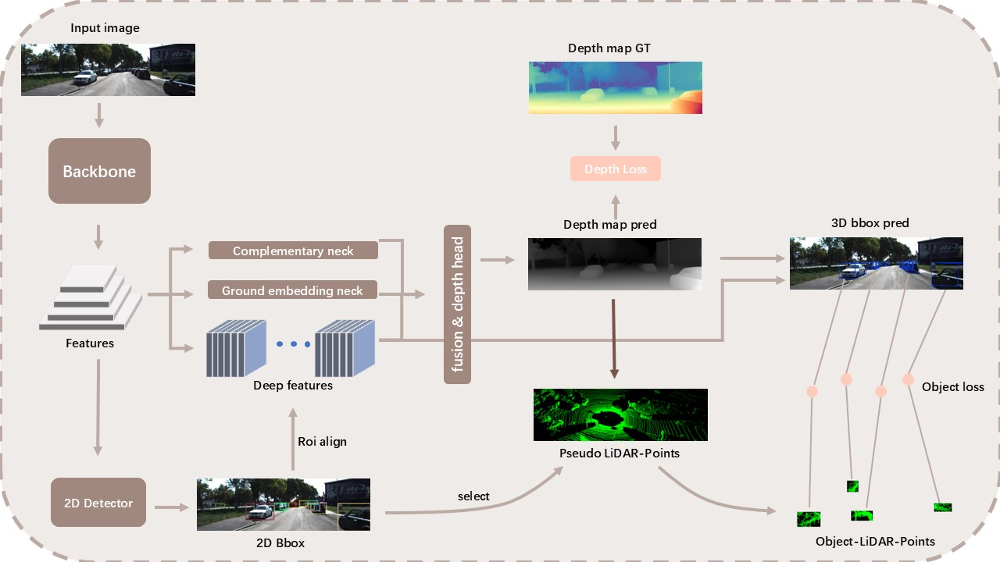

# WDM3D: Weakly-supervised depth-enhanced monocular 3D detector




## Install

run the following commands step by step

```shell
git clone git@github.com:qgq99/WDM3D.git

conda create -n wdm3d python=3.10

conda activate wdm3d

conda install pytorch==2.5.1 torchvision==0.20.1 pytorch-cuda=11.8 -c pytorch -c nvidia

cd WDM3D

python setup.py develop
```

## Data preparaion
### KIITI
1. download KIITI 3D detection dataset from [this link](https://www.cvlibs.net/datasets/kitti/eval_object.php?obj_benchmark=3d), and then organize the directory as:
```
KITTI
    - train
        - calib
            - 000000.txt
            - ...
        - image_2
            - 000000.png
            - ...
        - label_2
            - 000000.txt
            - ...
        - velodyne
            - 000000.bin
            - ...
    - test
        - calib
            - 000000.txt
            - ...
        - image_2
            - 000000.png
            - ...
        - velodyne
            - 000000.bin
            - ...
```
2. generate depth maps by running the following command:

This may take a little long time(about 40 minutes if not use interpolate else 2 hours), please be patient.

```
python dataset/script/generate_depth_map.py --kitti_dir your_KIITI_dir
```